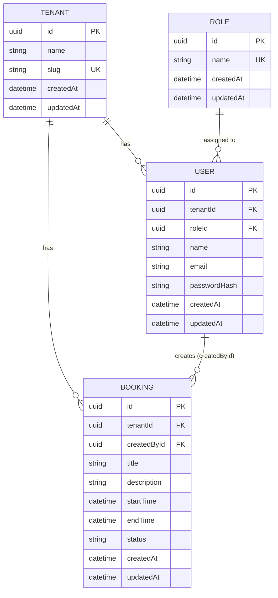
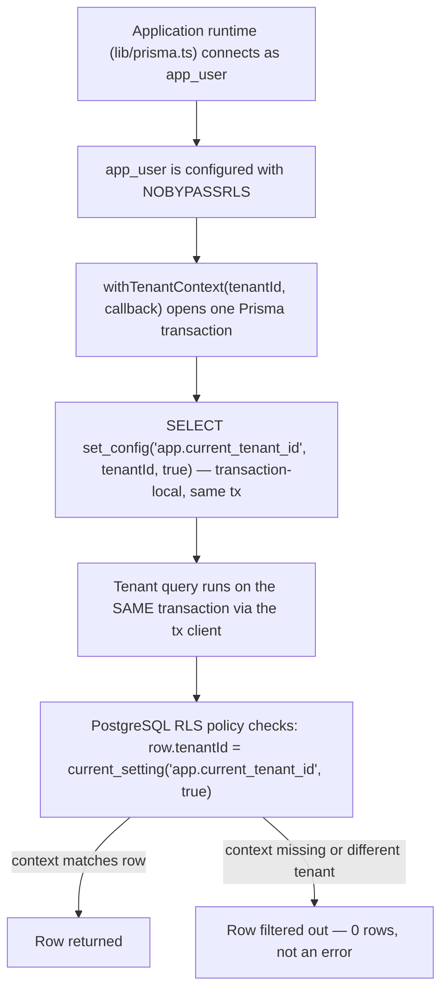

# Multi-Tenant Booking

A Week 1 internship project: a multi-tenant booking application built with Next.js, Prisma, and PostgreSQL Row-Level Security (RLS) for database-enforced tenant isolation.

## Week 1 Scope

This repository currently implements the **data and security foundation** of the application: schema, migrations, seed data, RLS policies, a tenant-context helper, an RBAC permission model, and a validated (but non-functional) authentication UI. It does not yet include real authentication, sessions, or any API routes/server actions wired to the database. See "Authentication Status" and "Future Work" below for exactly what is and isn't implemented.

## Technology Stack

Based on `package.json`:

| Package | Version | Purpose |
|---|---|---|
| next | 16.3.5 | App Router framework |
| react / react-dom | 19.2.8 | UI |
| typescript | ^5 | Type checking |
| tailwindcss / @tailwindcss/postcss | ^4 | Styling |
| prisma / @prisma/client | ^7.10.0 | ORM |
| @prisma/adapter-pg | ^7.10.0 | Prisma driver adapter for `pg` |
| pg | ^8.23.0 | PostgreSQL driver |
| zod | ^4.6.5 | Environment + form validation |
| bcryptjs | ^3.0.3 | Password hashing used by the seed data; real authentication is future work |
| dotenv | ^17.4.2 | Loads `.env` for scripts |
| tsx | ^4.23.13 (dev) | Runs TypeScript scripts (seed, RLS test) |

PostgreSQL 16 (`postgres:16-alpine`) runs via Docker Compose.

## Project Structure

```text
app/
  page.tsx                  Landing page
  login/page.tsx             Login UI (demo — see Authentication Status)
  register/page.tsx          Register UI (demo)
  onboarding/page.tsx        Organization onboarding UI (demo)
  forgot-password/page.tsx   Password reset request UI (demo)
components/auth/             Shared auth UI building blocks
lib/
  env.server.ts               Zod-validated environment variables
  prisma.ts                   Shared Prisma client (connects as app_user)
  tenant-context.ts           withTenantContext() helper
  rbac.ts                     Permission / role model
  auth/current-user.ts        Placeholder seam for future session lookup
  validation/auth.ts          Zod schemas for the auth forms
prisma/
  schema.prisma                Data model
  seed.ts                      Seed script
  migrations/
    20260918112814_init_multi_tenant_foundation/    Schema + RLS policies
    20260918201832_grant_app_user_table_privileges/ app_user grants
docker-compose.yml             PostgreSQL 16 service definition
docker/initdb/
  01-create-app-role.sh        Creates app_user on a fresh volume only
scripts/
  test-rls.ts                   RLS / tenant isolation test
```

## Data Model (ERD)



`User` has a unique constraint on `(tenantId, email)` — the same email can exist in different tenants, but not twice within one tenant. `Booking.status` is a Postgres enum: `PENDING`, `CONFIRMED`, `CANCELLED`, `COMPLETED`.

## Tenant Isolation / Security Flow



This is enforced at the database engine level, on `users` and `bookings` only. `tenants` is intentionally not RLS-protected in this Week 1 architecture because it represents the organization/tenant directory rather than tenant-scoped application data. `roles` is also shared reference data, used the same way by every tenant.

## Database Roles

| Role | Used for | Can bypass RLS? |
|---|---|---|
| `booking_dev` | Prisma CLI migrations / database administration (`DATABASE_URL`) | Yes — superuser, by design, needed to create/alter tables |
| `app_user` | Application runtime + seed script (`APP_DATABASE_URL`) | No — configured with `NOBYPASSRLS` |

Separating these matters because RLS is meaningless if the connection running normal queries can ignore it. `lib/prisma.ts` — the Prisma client used by the application runtime — connects through `APP_DATABASE_URL`, keeping normal application queries separate from the privileged migration role.

## RBAC

Defined in `lib/rbac.ts`. Roles and permissions, as actually coded:

| Role | Permissions |
|---|---|
| `ADMIN` | `MANAGE_ORGANIZATION`, `MANAGE_USERS`, `MANAGE_ROLES`, `MANAGE_BOOKINGS`, `CREATE_BOOKINGS`, `VIEW_BOOKINGS` |
| `MANAGER` | `MANAGE_BOOKINGS`, `CREATE_BOOKINGS`, `VIEW_BOOKINGS` |
| `STAFF` | `CREATE_BOOKINGS`, `VIEW_BOOKINGS` |

`roleHasPermission()` and `requirePermission()` are authorization helper functions defined in `lib/rbac.ts`. RBAC is currently a foundation only: no API route or server action calls `requirePermission()` yet, because no such routes exist in the repository yet. It is not connected to a live authenticated request path.

## Authentication Status

Four UI routes exist: `/onboarding`, `/login`, `/register`, `/forgot-password`. Each is a client component that:

- Runs Zod validation (`lib/validation/auth.ts`) on submit
- Shows inline, per-field error messages on invalid input
- On valid input, shows a demo success message stating that backend authentication will be connected in a later implementation

None of these forms create real accounts, sessions, or perform real login. There is no password verification against `passwordHash`, no cookies, and no server-side session store.

`lib/auth/current-user.ts` exports `getCurrentUser()`, which always throws `AuthNotImplementedError`. This is intentional — it is a documented placeholder seam for future code to call, not a stub that fakes a logged-in user.

## Client-Side Validation

`lib/validation/auth.ts` defines four Zod schemas:

- `loginSchema` — email format, non-empty password, optional remember-me
- `registerSchema` — full name, email, 8+ character password, confirm-password match
- `onboardingSchema` — organization name, URL-safe slug (`^[a-z0-9]+(-[a-z0-9]+)*$`), admin name/email, password, confirm-password match
- `forgotPasswordSchema` — email format only

Password confirmation mismatches and other cross-field rules use Zod's `.refine()` and report the error on the `confirmPassword` field specifically.

## Environment Variables

Documented by name only — real values live in your local `.env` (git-ignored) and are validated at startup by `lib/env.server.ts`.

| Variable | Purpose |
|---|---|
| `POSTGRES_DB` | Database name (Docker Compose) |
| `POSTGRES_USER` | Bootstrap role name (`booking_dev`) |
| `POSTGRES_PASSWORD` | Bootstrap role password |
| `POSTGRES_PORT` | Host port Postgres is exposed on |
| `DATABASE_URL` | Connection string for `booking_dev` — Prisma CLI migrations only |
| `APP_DB_USER` | Application role name (`app_user`) |
| `APP_DB_PASSWORD` | Application role password |
| `APP_DATABASE_URL` | Connection string for `app_user` — used by the app runtime and the seed script |

`lib/env.server.ts` validates all eight with Zod at import time (`POSTGRES_PORT` as an integer 1–65535, both URLs as valid URL strings) and throws a clear error listing exactly which variable is missing or malformed if validation fails.

## Docker PostgreSQL Setup

`docker-compose.yml` runs a single `postgres:16-alpine` service (`multi-tenant-booking-db`) with a persistent named volume (`multi-tenant-booking-postgres-data`) and a healthcheck.

### Fresh Clone / New Volume

```bash
docker compose up -d
```

When PostgreSQL initializes a new/empty data volume, it automatically runs every script in `docker/initdb/` exactly once. `01-create-app-role.sh` creates the `app_user` role (`LOGIN`, `NOSUPERUSER`, `NOCREATEDB`, `NOCREATEROLE`, `NOBYPASSRLS`) using `APP_DB_USER`/`APP_DB_PASSWORD` from `.env`. This behavior is based on how the official PostgreSQL Docker image documents `docker-entrypoint-initdb.d`; it has not yet been separately verified in this repository against a true fresh-clone, fresh-volume run.

### Existing Volume

PostgreSQL skips `docker/initdb/` entirely once a data directory already contains a database, so this script has no effect on an already-running setup.

## Setup Commands

```bash
npm install
npx prisma generate
npx prisma migrate dev
npx prisma db seed
npm run dev
```

`npx prisma migrate dev` applies both migrations in order: the initial schema + RLS policies, then the `app_user` table-privilege grants (`GRANT SELECT, INSERT, UPDATE, DELETE` on `tenants`, `roles`, `users`, `bookings`).

## Seed Data

`prisma/seed.ts` connects as `app_user` (`APP_DATABASE_URL`) and uses fixed UUIDs with `upsert`, so it is safe to run repeatedly. Actual seeded data:

- **3 roles**: ADMIN, MANAGER, STAFF
- **3 tenants**: TechNova Solutions, Lahore Creative Studio, Pakistan Business Consultants
- **7 users** across the three tenants (3 for TechNova, 2 for Lahore Creative, 2 for Pakistan Business Consultants)
- **6 bookings** (2 per tenant), with statuses spanning `PENDING`, `CONFIRMED`, `COMPLETED`, and `CANCELLED`

All seeded users share one development password hash generated from a fixed placeholder password — this exists only to satisfy the `passwordHash` NOT NULL column and has no relationship to real authentication, which is not implemented.

Users and bookings are inserted using `withTenantContext(tenantId, ...)` so each insert passes the same RLS policies that runtime queries would.

## Testing Tenant Isolation

```bash
npm run test:rls
```

Runs `scripts/test-rls.ts`, which connects as `app_user` (never `booking_dev`, since that role bypasses RLS) and verifies:

- No tenant context set → 0 users, 0 bookings visible
- TechNova Solutions context → exactly 3 users, 2 bookings visible
- Lahore Creative Studio context → exactly 2 users, 2 bookings visible
- While scoped to TechNova, explicitly querying for Lahore Creative's `tenantId` returns 0 rows

## Verification Commands

```bash
npx prisma validate
npx tsc --noEmit
npm run lint
npm run build
npm run test:rls
```

## Security Boundaries

- RLS on `users`/`bookings`, enforced by PostgreSQL itself, is the actual security boundary — not application code.
- `withTenantContext()` is a convention that makes the correct pattern easy; it does not prevent other code from querying `prisma` directly without it. If that happened, RLS still fails closed (0 rows), it does not leak data.
- `app_user` is configured with `NOBYPASSRLS`, so the application runtime role cannot bypass PostgreSQL RLS.
- `tenants` and `roles` are intentionally not RLS-protected (see "Tenant Isolation / Security Flow" above).
- RBAC permission helpers are defined in `lib/rbac.ts`; they are not yet connected to a live authenticated request path.

## Week 1 Completion Checklist

- [x] Next.js App Router project with TypeScript + Tailwind CSS 4
- [x] Zod-validated environment variables
- [x] Docker Compose PostgreSQL 16 setup
- [x] Schema: Tenant, User, Role, Booking
- [x] Database migrations
- [x] Realistic, repeatable seed data
- [x] PostgreSQL RLS enforcing tenant isolation on `users` / `bookings`
- [x] `app_user` role with `NOBYPASSRLS`, separate from the migration role
- [x] Transaction-scoped tenant-context helper (`withTenantContext`)
- [x] RBAC permission model (ADMIN/MANAGER/STAFF)
- [x] Repeatable RLS isolation test (`npm run test:rls`)
- [x] Tailwind auth UI: onboarding, login, register, forgot-password
- [x] Client-side Zod validation on all four auth forms
- [x] README documentation with Mermaid ERD and tenant-isolation/security flow

## Future Work

The following are explicitly not implemented and should not be assumed to exist:

- Real user authentication (password verification, sessions/cookies)
- Real organization/user/booking creation via API routes or server actions
- `getCurrentUser()` returning a real user instead of throwing
- RBAC checks actually guarding live authenticated server operations
- API routes / server actions
- Email delivery for password reset
