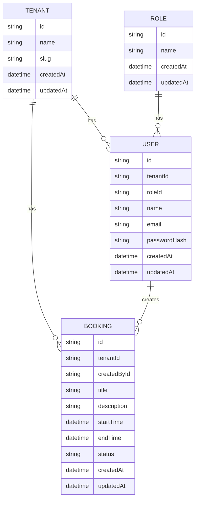
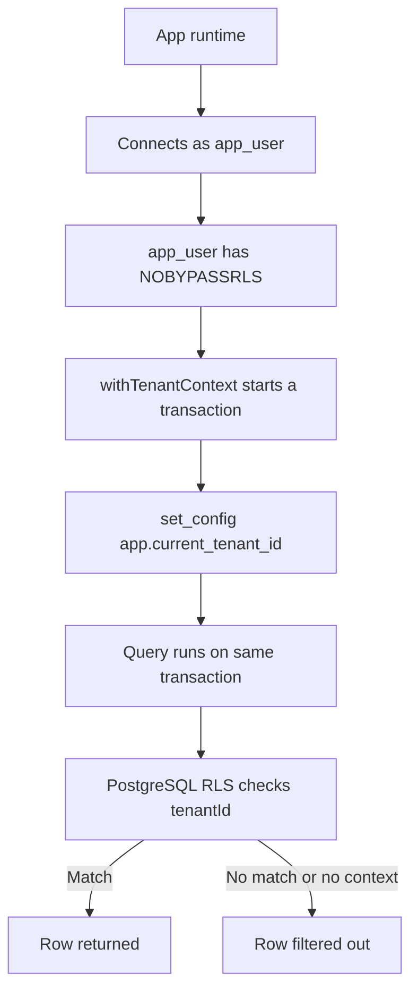

# Multi-Tenant Booking

A multi-tenant booking application built with Next.js, Prisma, and PostgreSQL Row-Level Security (RLS) for database-enforced tenant isolation. Originally a Week 1 internship project; now includes Week 2's real authentication, idempotent booking APIs, and a working booking UI.

## Project Overview

Each organization ("tenant") gets an isolated workspace for managing bookings and staff. Tenant isolation is enforced at the PostgreSQL engine level via Row-Level Security, not just in application code, so a bug in application logic cannot leak one tenant's data into another's view. Authentication is real, server-side, cookie-based sessions — no JWT, no third-party auth framework. Booking creation is idempotent, protected by a database-level unique constraint rather than application-only bookkeeping.

## Week 1 Foundation

Week 1 established the data and security foundation: schema (`Tenant`, `Role`, `User`, `Booking`), migrations, seed data, PostgreSQL RLS on `users`/`bookings`, a transaction-scoped tenant-context helper (`withTenantContext`), an RBAC permission model (`lib/rbac.ts`), and a validated Tailwind auth UI (`/login`, `/register`, `/onboarding`, `/forgot-password`). At that stage, `/register` and `/onboarding` accepted input and validated it client-side but had no real backend behind them, and there was no real login yet.

## Week 2 Features

- Real server-side, cookie-based session authentication (`POST /api/auth/login`, `POST /api/auth/logout`)
- Five idempotent, tenant-isolated booking API endpoints under `/api/bookings`
- Strict Zod validation on every booking request (create, update, list filters, route id)
- A standard, consistent API success/error response format across every endpoint
- `Idempotency-Key`-protected booking creation, backed by a database unique constraint and a `SECURITY DEFINER`-free, RLS-protected `idempotency_keys` table
- A Postman collection covering authentication, booking CRUD, validation/error cases, and idempotency replay/conflict behavior
- A responsive booking calendar/list UI, create/edit forms, booking detail view, delete-with-confirmation, toast notifications, retry buttons, and automatic redirect-to-login on session expiry

`/register` and `/onboarding` remain demo UI — this was intentionally out of scope for Week 2 (see "Known Limitations" below).

## Technology Stack

Based on `package.json`:

| Package | Version | Purpose |
|---|---|---|
| next | 16.3.5 | App Router framework |
| react / react-dom | 19.2.8 | UI |
| typescript | ^5 | Type checking |
| tailwindcss / @tailwindcss/postcss | ^4 | Styling |
| prisma / @prisma/client | ^7.10.0 | ORM |
| @prisma/adapter-pg | ^7.10.0 | Prisma driver adapter for `pg` |
| pg | ^8.23.0 | PostgreSQL driver |
| zod | ^4.6.5 | Environment, session/session-header, and booking request validation |
| bcryptjs | ^3.0.3 | Password hashing, used by both the seed data and real login password verification |
| dotenv | ^17.4.2 | Loads `.env` for scripts |
| tsx | ^4.23.13 (dev) | Runs TypeScript scripts (seed, tests) |

PostgreSQL 16 (`postgres:16-alpine`) runs via Docker Compose. No new dependency (e.g. `react-hook-form`, a calendar library, a toast library) was added for Week 2 — forms use plain `useState`, and toasts are a small hand-rolled context provider, consistent with the project's existing minimal-dependency approach.

## Project Structure

```text
app/
  page.tsx                        Landing page
  login/page.tsx                   Real login UI, calls POST /api/auth/login
  register/page.tsx                Register UI (demo — see Known Limitations)
  onboarding/page.tsx               Organization onboarding UI (demo)
  forgot-password/page.tsx         Password reset request UI (demo)
  dashboard/
    layout.tsx                      Shared authenticated shell (header, logout, toast provider)
    page.tsx                        Post-login landing page
    bookings/
      page.tsx                      Booking calendar/list
      new/page.tsx                  Create booking
      [id]/page.tsx                 Booking detail
      [id]/edit/page.tsx            Edit booking
  api/
    auth/login/route.ts             POST /api/auth/login
    auth/logout/route.ts            POST /api/auth/logout
    bookings/route.ts                GET (list) + POST (create, idempotent)
    bookings/[id]/route.ts           GET / PATCH / DELETE one booking
components/
  auth/                             AuthShell, FormField, SubmitButton, icons, LogoutButton
  bookings/                         BookingsBrowser, BookingForm, EditBookingForm, BookingDetail,
                                     BookingStatusBadge, ConfirmDialog
  ui/Toast.tsx                       Toast provider/hook
lib/
  env.server.ts                      Zod-validated environment variables
  prisma.ts                          Shared Prisma client (connects as app_user)
  session.ts                         Session creation/lookup/invalidation
  tenant-context.ts                  withTenantContext() helper
  rbac.ts                            Permission / role model + requirePermission()
  auth/current-user.ts               getCurrentUser(), UnauthenticatedError
  validation/auth.ts                 Zod schemas for the auth forms
  validation/bookings.ts             Zod schemas for booking create/update/list/id
  validation/idempotency.ts          Zod schema for the Idempotency-Key header
  api/errors.ts                      Standard response helpers + error-to-HTTP mapping
  api/idempotency.ts                 hashBookingRequest() + createIdempotentBooking()
  api/booking-client.ts              Browser-side fetch helpers used by the frontend
prisma/
  schema.prisma                      Data model (Tenant, Role, User, Booking, Session, IdempotencyKey)
  seed.ts                            Seed script
  migrations/
    20260918112814_init_multi_tenant_foundation/       Schema + RLS policies (users, bookings)
    20260918201832_grant_app_user_table_privileges/     app_user grants (tenants/roles/users/bookings)
    20260924080000_add_sessions_table/                  Session table (no RLS — see below)
    20260924081500_add_login_lookup_function/           find_user_for_login() SECURITY DEFINER function
    20260925090000_add_idempotency_keys_table/          idempotency_keys table + RLS + narrow grants
docker-compose.yml                   PostgreSQL 16 service definition
docker/initdb/01-create-app-role.sh  Creates app_user on a fresh volume only
scripts/
  test-rls.ts                        Tenant isolation test
  test-auth.ts                       Session/login test
  test-bookings.ts                   Booking data-layer + tenant-isolation test
  test-idempotency.ts                Idempotency data-layer test
  test-admin-client.ts               Test-only privileged connection, used only for test cleanup
postman/
  Multi-Tenant-Booking.postman_collection.json  Importable API collection
```

## Architecture / Data Model


```mermaid
erDiagram
    TENANT ||--o{ USER : has
    TENANT ||--o{ BOOKING : has
    ROLE ||--o{ USER : has
    USER ||--o{ BOOKING : creates

    TENANT {
        string id
        string name
        string slug
        datetime createdAt
        datetime updatedAt
    }
    ROLE {
        string id
        string name
        datetime createdAt
        datetime updatedAt
    }
    USER {
        string id
        string tenantId
        string roleId
        string name
        string email
        string passwordHash
        datetime createdAt
        datetime updatedAt
    }
    BOOKING {
        string id
        string tenantId
        string createdById
        string title
        string description
        datetime startTime
        datetime endTime
        string status
        datetime createdAt
        datetime updatedAt
    }
```

`id` fields are UUIDs (`@db.Uuid`). `Tenant.slug` and `Role.name` are unique. `User` has a unique constraint on `(tenantId, email)`. `Booking.status` is a Postgres enum: `PENDING`, `CONFIRMED`, `CANCELLED`, `COMPLETED`. Two additional models, `Session` and `IdempotencyKey`, support Week 2 and are described in their own sections below.

## Authentication & Session Security

`POST /api/auth/login` validates credentials with Zod, looks up the user via `find_user_for_login(email)`, verifies the password with `bcryptjs`, creates a server-side session, and sets an httpOnly `session_token` cookie. It returns the same generic "Invalid email or password" error whether the email doesn't exist or the password is wrong. `POST /api/auth/logout` deletes the session and clears the cookie, and is safe to call repeatedly.

- **Cookie contents**: an httpOnly cookie holds only an opaque, cryptographically random 256-bit token — never a JWT, never any user/tenant/role information. `sameSite=lax`, `secure` in production, 7-day expiry.
- **Server-side storage**: only a SHA-256 hash of the token is stored, in the `Session` table. Reading that table alone never yields a usable, replayable token.
- **Why `Session` has no RLS**: a session lookup must happen *before* the tenant is known — the tenant is what the lookup discovers. Safety instead comes from the token being a 256-bit random value looked up by exact match, and `app_user` only holding the privileges explicitly granted on this table.
- **`getCurrentUser()`** (`lib/auth/current-user.ts`) reads the session cookie, looks it up (in two steps — see below), and returns `{ id, tenantId, roleName, email }`, or throws `UnauthenticatedError` if there is no valid session.
- **Two-step session lookup**: `lookupSession()` first queries only the `sessions` table (no tenant context needed or available), and only after learning the tenant from that row does it call `withTenantContext(session.tenantId, ...)` to safely load the `User`/`Role` data, which *is* RLS-protected. A single joined query would have silently returned nothing, since no tenant context exists until the session itself reveals it.
- **The login-lookup problem**: `users` has `FORCE ROW LEVEL SECURITY`, so a plain "find user by email" query with no tenant context would always return zero rows. Rather than weaken that policy, login calls `find_user_for_login(email)`, a `SECURITY DEFINER` SQL function owned by `booking_dev` (a superuser). `app_user` is granted `EXECUTE` on this one function only — it still cannot query `users` directly without tenant context for anything else.
- **No new environment variable/secret was introduced** for sessions — the token already has 256 bits of true randomness before hashing.

## Multi-Tenancy & PostgreSQL RLS


```mermaid
flowchart TD
    A[App runtime] --> B[Connects as app_user]
    B --> C[app_user has NOBYPASSRLS]
    C --> D[withTenantContext starts a transaction]
    D --> E[set_config app.current_tenant_id]
    E --> F[Query runs on same transaction]
    F --> G[PostgreSQL RLS checks tenantId]
    G -->|Match| H[Row returned]
    G -->|No match or no context| I[Row filtered out]
```

`lib/prisma.ts` connects as `app_user`, which is configured with `NOBYPASSRLS`. `withTenantContext(tenantId, callback)` opens a single Prisma transaction, runs `SELECT set_config('app.current_tenant_id', tenantId, true)` — transaction-local — and then runs the query using the same transaction client (`tx`). RLS on `users`, `bookings`, and (as of Week 2) `idempotency_keys` compares each row's `tenantId` against that setting: matching rows are returned, everything else is filtered out at the database level, returning zero rows rather than an error.

`tenants` and `roles` are intentionally not RLS-protected: `tenants` is the organization directory itself, and `roles` is shared reference data used identically by every tenant.

| Role | Used for | Can bypass RLS? |
|---|---|---|
| `booking_dev` | Prisma CLI migrations / database administration (`DATABASE_URL`) | Yes — superuser, by design |
| `app_user` | Application runtime + seed script (`APP_DATABASE_URL`) | No — configured with `NOBYPASSRLS` |

Separating these matters because RLS is meaningless if the connection running normal queries can ignore it. `lib/prisma.ts` is hard-wired to `APP_DATABASE_URL`, so runtime code can never accidentally use the privileged migration role.

## RBAC

Defined in `lib/rbac.ts`:

| Role | Permissions |
|---|---|
| `ADMIN` | `MANAGE_ORGANIZATION`, `MANAGE_USERS`, `MANAGE_ROLES`, `MANAGE_BOOKINGS`, `CREATE_BOOKINGS`, `VIEW_BOOKINGS` |
| `MANAGER` | `MANAGE_BOOKINGS`, `CREATE_BOOKINGS`, `VIEW_BOOKINGS` |
| `STAFF` | `CREATE_BOOKINGS`, `VIEW_BOOKINGS` |

`requirePermission(roleName, permission)` throws `ForbiddenError` (mapped to `403 FORBIDDEN`) if the role lacks the permission. As of Week 2, this is genuinely enforced on a live request path: every booking API route calls `requirePermission()`, using the role loaded from the verified session — never from client input — before performing its operation. The frontend also hides Edit/Delete controls for roles without `MANAGE_BOOKINGS`, but this is cosmetic only; the server-side check is what actually protects the data.

## Booking API Documentation

| Method | Path | Permission | Purpose |
|---|---|---|---|
| GET | `/api/bookings` | `VIEW_BOOKINGS` | List the caller's tenant's bookings (filters: `status`, `startDate`, `endDate`; paginated via `page`/`pageSize`) |
| POST | `/api/bookings` | `CREATE_BOOKINGS` | Create a booking (idempotent — see below) |
| GET | `/api/bookings/:id` | `VIEW_BOOKINGS` | Get one booking |
| PATCH | `/api/bookings/:id` | `MANAGE_BOOKINGS` | Update a booking |
| DELETE | `/api/bookings/:id` | `MANAGE_BOOKINGS` | Delete a booking |

**Server-controlled fields**: `id`, `tenantId`, `createdById`, `createdAt`, `updatedAt` are never accepted from the client. `tenantId` and `createdById` come only from `getCurrentUser()`; `status` on create always defaults to `PENDING`. A booking id belonging to another tenant is invisible via RLS — the API always responds `404 NOT_FOUND`, never revealing that a row exists under a different tenant.

Security flow per request:

```
getCurrentUser()          -- userId + tenantId + role, from the verified session cookie
        ↓
requirePermission()       -- checks the role against the required Permission
        ↓
withTenantContext(user.tenantId, ...)  -- opens a transaction, sets app.current_tenant_id
        ↓
Prisma query (via tx)     -- runs inside that transaction
        ↓
PostgreSQL RLS            -- the actual enforcement layer
```

## Idempotency

`POST /api/bookings` requires an `Idempotency-Key` header on every request.

| Situation | Behavior |
|---|---|
| Missing or empty header | `400 VALIDATION_ERROR` |
| Header longer than 255 characters | `400 VALIDATION_ERROR` |
| New key | Creates the booking, `201`, stores the response |
| Same key, same tenant, same normalized payload | Returns the **original** stored `201` response; no new booking created |
| Same key, same tenant, different normalized payload | `409 IDEMPOTENCY_KEY_CONFLICT`; no new booking created |
| Same key, different tenant | Independent key (unique constraint is `(tenantId, key)`) |

**Request hash**: SHA-256 of the validated, normalized payload only — `title` (trimmed), `description` (trimmed or `null`), `startTime`/`endTime` (ISO strings). Never includes `tenantId`, `createdById`, the key itself, or session data.

**Transactional safety**: the booking and its idempotency record are created inside one transaction, protected by a `UNIQUE (tenantId, key)` constraint — the constraint, not application logic, is what makes concurrent duplicate requests safe. A losing insert fails with a unique-constraint violation, which rolls back its own booking insert too (same transaction); the loser then opens a fresh transaction to read whichever result the winner committed.

`idempotency_keys` has RLS enabled and forced, scoped by `app.current_tenant_id` exactly like `bookings`. `app_user` is granted only `SELECT, INSERT` on it (narrower than `bookings`), since the application never updates or deletes an idempotency record.

## Standard API Response Format

Success:
```json
{ "success": true, "data": ... }
```

Error:
```json
{ "success": false, "error": { "code": "...", "message": "...", "details": ... } }
```

| Situation | Status | Code |
|---|---|---|
| Not logged in | 401 | `UNAUTHENTICATED` |
| Invalid login credentials | 401 | `INVALID_CREDENTIALS` |
| Logged in, lacks permission | 403 | `FORBIDDEN` |
| Invalid body/params | 400 | `VALIDATION_ERROR` |
| Booking not found / wrong tenant | 404 | `NOT_FOUND` |
| Idempotency key reused with a different payload | 409 | `IDEMPOTENCY_KEY_CONFLICT` |
| Unexpected error | 500 | `INTERNAL_ERROR` |

Errors never expose stack traces, SQL details, password hashes, or session tokens (`lib/api/errors.ts`).

## Frontend Booking UI

- **`BookingsBrowser`** — a week-strip (previous/next/Today navigation) plus a day-grouped agenda list, or a toggle to an "All Bookings" view. Not a drag-and-drop calendar grid — a deliberate choice to avoid adding a calendar library (see Known Limitations).
- **`BookingForm`** — shared by create and edit; client-side Zod validation (`createBookingSchema`/`updateBookingSchema`), inline field errors, and idempotency-key generation on create (a new key per distinct payload; the same key is reused automatically on retry of an unchanged submission).
- **`BookingDetail`** — full booking view, with Edit/Delete shown only when the current role has `MANAGE_BOOKINGS`.
- **`ConfirmDialog`** — used before delete.
- **`Toast`** (`components/ui/Toast.tsx`) — success/error toasts on create, update, and delete.
- Every data-fetching component has explicit loading, empty, and error states, with a Retry button on failure, and redirects to `/login` automatically if any request returns `401 UNAUTHENTICATED`.
- Mentor feedback on the Week 1 auth UI was positive regarding the reusable `AuthShell`/`FormField` components, Zod validation, and overall UI cleanliness. Adopting `react-hook-form` was suggested as a possible future improvement — it is **not** currently used anywhere in the project; forms use plain `useState`.

## Validation & Error Handling

`lib/validation/bookings.ts` defines strict (`.strict()`) Zod schemas for create/update, rejecting any unexpected key outright (this is what stops a client from sending `tenantId` or `createdById`, independent of the route handlers never reading those fields anyway). `lib/validation/idempotency.ts` validates the `Idempotency-Key` header (non-empty, ≤255 characters). `lib/validation/auth.ts` covers the four auth forms, unchanged since Week 1.

## Postman Collection

`postman/Multi-Tenant-Booking.postman_collection.json` covers Authentication (login as an ADMIN and a STAFF user, logout), Bookings (full CRUD), Validation & Errors (missing idempotency key, invalid time range, unauthenticated, forbidden-as-staff, not-found), and Idempotency (first request, same-key replay, same-key-different-payload conflict). Uses the project's real cookie-based session auth via Postman's built-in cookie jar — no Bearer token or API key. Import it into Postman, run `npm run dev` first, log in via the Authentication folder, then run the other folders in order.

## Environment Variables

| Variable | Purpose |
|---|---|
| `POSTGRES_DB` | Database name (Docker Compose) |
| `POSTGRES_USER` | Bootstrap role name (`booking_dev`) |
| `POSTGRES_PASSWORD` | Bootstrap role password |
| `POSTGRES_PORT` | Host port Postgres is exposed on |
| `DATABASE_URL` | Connection string for `booking_dev` — Prisma CLI migrations only |
| `APP_DB_USER` | Application role name (`app_user`) |
| `APP_DB_PASSWORD` | Application role password |
| `APP_DATABASE_URL` | Connection string for `app_user` — used by the app runtime and the seed script |

No new environment variables were introduced for Week 2's sessions or idempotency. `lib/env.server.ts` validates all eight with Zod at import time.

## Docker/PostgreSQL Setup

`docker-compose.yml` runs a single `postgres:16-alpine` service with a persistent named volume and a healthcheck.

```bash
docker compose up -d
```

On a genuinely new/empty volume, Postgres runs `docker/initdb/01-create-app-role.sh` exactly once, creating `app_user` (`LOGIN`, `NOSUPERUSER`, `NOCREATEDB`, `NOCREATEROLE`, `NOBYPASSRLS`). On an existing volume, this script is skipped entirely — no effect on an already-running setup. This fresh-volume behavior has not been separately verified in this repository against a true fresh-clone run.

## Setup Instructions

```bash
npm install
npx prisma generate
npx prisma migrate dev
npx prisma db seed
npm run dev
```

`npx prisma migrate dev` applies all five migrations in order (see Project Structure above): the initial schema + RLS, `app_user` table grants, the `Session` table, the `find_user_for_login()` function, and the `idempotency_keys` table + its RLS + grants.

## Seed Data / Development Credentials

`prisma/seed.ts` connects as `app_user` and uses fixed UUIDs with `upsert`, safe to run repeatedly:

- **3 roles**: ADMIN, MANAGER, STAFF
- **3 tenants**: TechNova Solutions, Lahore Creative Studio, Pakistan Business Consultants
- **7 users** across the three tenants (3 TechNova, 2 Lahore Creative, 2 Pakistan Business Consultants)
- **6 bookings** (2 per tenant), statuses spanning `PENDING`, `CONFIRMED`, `COMPLETED`, `CANCELLED`

All seeded users share one fixed development password hash (`Password123!`), used only to satisfy the `passwordHash` NOT NULL column and for local login testing — not a production credential. Since `/register` has no real backend yet, **only these seeded users can log in**; there is no self-serve account creation.

## Testing & Verification Commands

```bash
npx prisma validate
npx prisma migrate status
npx tsc --noEmit
npm run lint
npm run build
npm run test:rls
npm run test:auth
npm run test:bookings
npm run test:idempotency
```

- `test:rls` — tenant isolation on `users`/`bookings` (exact seeded counts per tenant, cross-tenant queries return nothing).
- `test:auth` — login lookup, password verification, session creation/lookup/expiry/logout, via the same two-step lookup path the app uses.
- `test:bookings` — booking data-layer tenant isolation and server-controlled `tenantId`.
- `test:idempotency` — data-layer idempotency: new-key creation, same-key replay, conflict on payload mismatch, cross-tenant independence, failed-create leaves no orphaned record, and genuine concurrency (5 simultaneous requests resolve to one booking).

All four scripts test the **data layer** directly (not raw HTTP) — verify the actual HTTP/header-parsing behavior manually via the Postman collection or `npm run dev` + browser testing.

## Responsive UI

The booking calendar/list, forms, and detail views use Tailwind's responsive utilities and have been manually tested across desktop, tablet, and mobile viewport widths, consistent with the existing dark, glassmorphic auth UI styling.

## Known Limitations / Future Improvements

- `/register` and `/onboarding` remain demo UI only — no real account/organization creation backend (out of scope for Week 2).
- Only the seeded development users can log in; login resolves by email only (if the same email were ever seeded across two tenants, only one would be reachable).
- "Remember me" is captured by the login form but does not yet change session length (flat 7-day expiry for every session).
- No rate limiting or brute-force protection on `/api/auth/login`.
- Expired sessions are cleaned up opportunistically on lookup only, not by a scheduled job.
- `BookingsBrowser` is a week-strip + agenda list, not a drag-and-drop calendar grid — adding a calendar library is a possible future addition, not adopted here to avoid an unnecessary dependency.
- Adopting `react-hook-form` for form state (mentor suggestion) is a possible future improvement; not implemented.
- No booking time-conflict/double-booking detection.
- Idempotency and booking data-layer tests do not cover the real HTTP/header-parsing layer — only manual/Postman verification does.

## Week 2 Completion Checklist

- [x] Idempotent booking CRUD APIs (list, get, create, update, delete)
- [x] Strict Zod validation on all booking requests
- [x] Standard, consistent API success/error response format
- [x] Full error-code set including `IDEMPOTENCY_KEY_CONFLICT`
- [x] Postman collection covering auth, booking CRUD, validation/errors, and idempotency
- [x] Real server-side, cookie-based session authentication (login/logout)
- [x] RBAC (`requirePermission`) enforced on every booking API route
- [x] Tenant isolation enforced by PostgreSQL RLS, including the new `idempotency_keys` table
- [x] Booking calendar/list UI with week and all-bookings views
- [x] Create Booking form with client-side validation and idempotency-key handling
- [x] Booking detail view
- [x] Edit and delete flows, with delete confirmation
- [x] Frontend API error handling with retry buttons and session-expiry redirect
- [x] Toast notifications
- [x] Mobile-responsive layout
- [x] README updated comprehensively for Week 2

## Week 3 (in progress): Billing Foundation
Phase 2 adds the billing database foundation only — no checkout, webhook, or
UI yet. New tables: `TenantBillingAccount`, `Subscription`, `Invoice` (RLS
enabled + forced, same tenant-isolation pattern as `bookings`), and
`ProcessedStripeEvent` (no RLS — see architecture notes). New permissions:
`VIEW_BILLING`, `MANAGE_BILLING`. Stripe env vars (`STRIPE_SECRET_KEY`,
`STRIPE_WEBHOOK_SECRET`, `STRIPE_PRICE_ID_BASIC`, `STRIPE_PRICE_ID_PRO`) are
optional for local dev — see `.env.example`.